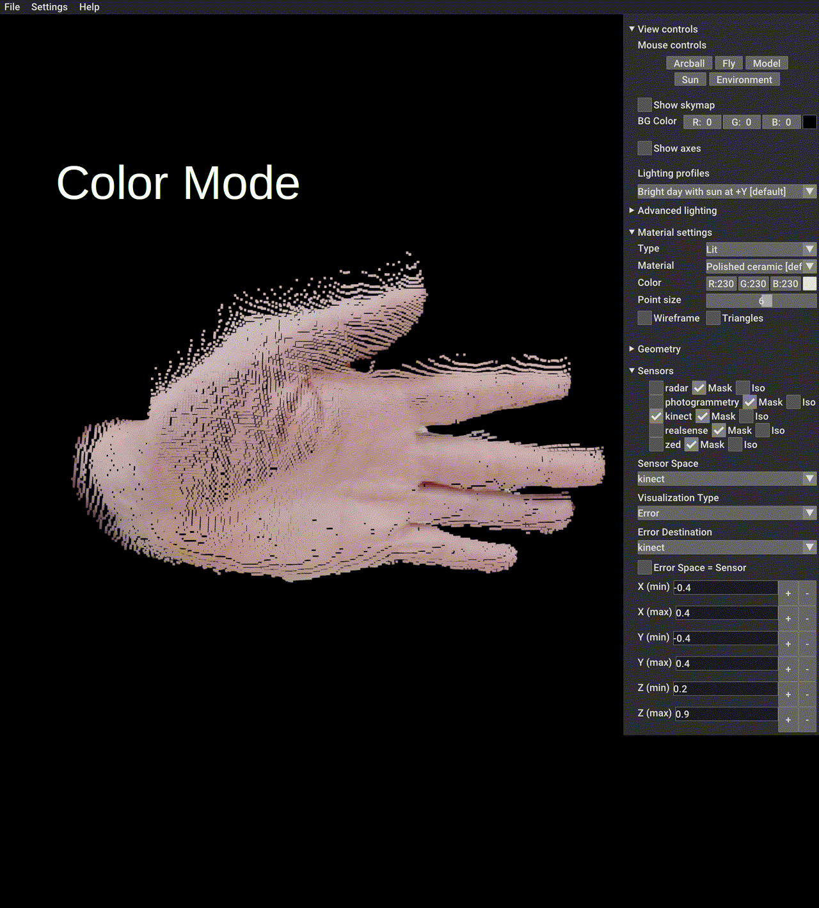

[![CC BY-NC 4.0][cc-by-nc-shield]][cc-by-nc]

[![CC BY-NC 4.0][cc-by-nc-image]][cc-by-nc]

### [Project Page 🌐](https://vwirth.github.io/maroon) | [Paper 🗒️]() |  [Arxiv 📚]() 

# 🌰 MAROON Documentation

This is the official code repository accompanying the paper [MAROON]().  
It includes a python-based dataset viewer and provides data preprocessing code for all sensor measurements of:
* Microsoft Kinect Azure
* Intel Realsense D435i
* Stereolabs Zed X Mini
* Rohde & Schwarz's QAR50 radar submodule
* Groundtruth Multi View Stereo reconstructions with Agisoft Metashape

Furthermore, it includes the reconstruction code for the MIMO imaging radar measurements.




## Table of Contents
* [Dependencies](#dependencies)
* [Dataset Structure](#dataset-structure)
* [Configuration](#configuration)
* [Execution](#execution)

## Dependencies

* All basic dependencies are listed in `maroon/setup.py`. To install the `maroon` package, run:
```
cd code/maroon;
python3 -m pip install setup.py 
```

**[Optional]:** To visualize all sensor data, the installation requires several sensor-specific packages:
* `pykinect_azure` (Microsoft Azure Kinect)
* `pyzed` (Stereolabs ZED)
* `pyrealsense2` (Intel Realsense)
If you only want to visualize photogrammetry and radar data, you can skip installation of these dependencies. 
Make sure to adjust the `sensor_in_use` option in your configuration file in this case (see [configuration](#configuration))
Further Installation instructions about these additional packages is provided below.


#### Pykinect Azure (Optional)
If you wish to include the Microsoft Kinect, this repository adapts code from Ibai Gorordo's [pyKinectAzure](https://github.com/ibaiGorordo/pyKinectAzure), which is located in `external/pykinect_azure`. To install this package, run:
```
cd external/pykinect_azure;
python -m pip install setup.py 
```
#### Pyzed (4.2.0) (Optional)
Installation instructions are explained [here](https://www.stereolabs.com/docs/app-development/python/install)

Install the following packages
```
python -m pip install cython numpy opencv-python pyopengl
```
To install the ZED python package, you need to download the ZED SDK [here](https://www.stereolabs.com/en-de/developers/release).
If this is causing any problems, please not that the currently tested version for this setup is `4.2.0`.
After installation, you can get the python package `pyzed` by invoking the respective installation script:
```
python get_python_api.py
```
In the installation directory.

#### Pyrealsense2 (Optional)
The package can be simply installed with
```
python -m pip install pyrealsense2
```

## Dataset structure

### Overview
The MAROON dataset contains the following structure:
```bash
maroon
|
|--> <objectname2>
    # object-to-sensor distance at 30 cm (from radar's perspective)
    |--> 30
        |--> metadata.json
        |--> alignment.json
        |--> radar_72.0_82.0_128
        |--> photogrammetry
        |--> kinect
        |--> zed
        |--> realsense
    # object-to-sensor distance at 40 cm (from radar's perspective)
    |--> 40
    # object-to-sensor distance at 50 cm (from radar's perspective)
    |--> 50
|--> <objectname2>
|--> ...
```

The `metadata.json` file contains metadata about the object capture such as:
```json
{
    # name of the coarse calibration object that is located in the `calibration_01` directory
    "calibration": "01_registration_coarse",
    # name of the fine calibration object that is located in the `calibration_01` directory
    "calibration_fine": "01_registration_fine",
    # approximate distance of the object to the radar sensor 
    "distance_meters": 0.3,
    # mask erosion kernel size that is used in the paper to evaluate P_e
    "mask_erosion": 20,
    # object labels that were used in GroundedSAM for semi-automatic object segmentation
    "labels": ["sigma"],
    # bounding box parameters (in radar space, in meters) that limit the spatial extents, in which the depth deviation metrics are calculated
    "mask_bb": {"zmin": 0.23, "zmax": 0.1}
}
```

The `alignment.json` file contains intermediate data about the calibration procedure as well as the calibration results, which are transformation matrices between sensor spaces:
```json
{
    # 4x4 matrix in row-first order that transforms from kinect space to photogrammetry space
    "kinect2photogrammetry": [0,0,0,0], [0,0,0,0], [0,0,0,0], [0,0,0,1],
    # transforms from kinect -> radar
    "kinect2radar": [0,0,0,0], [0,0,0,0], [0,0,0,0], [0,0,0,1],
    # transforms from the original sensor space to an intermediate, so-called 'world space',  which is the same for all sensors and has the following coordinates:
    # Y
    # ^
    # |   z
    # |  /
    # | /
    # \------> X
    "kinect2world": [0,0,0,0], [0,0,0,0], [0,0,0,0], [0,0,0,1],
    # some intermediate data that was used for calibration
    "kinect_calib" : {} 
    
    ...

    "photogrammetry2kinect": ...
    "photogrammetry2realsense": ...
    "photogrammetry2zed" : ...
    "photogrammetry2radar" : ...
    "photogrammetry2world": ...
    "photo_calib": ...

    ... analogous for all other sensors
}

```

### Radar
The radar directory structure looks like this:
```bash
|--> radar_72.0_82.0_128
    # stores metadata about the reconstruction process
    |--> calibration.json
    # contains, for each frame, the raw radar data, which is a tensor of 94x94x128 complex numbers
    # the additional 'emptyfiltered' versions contain data that was pre-calibrated to filter
    # out systematic noise patterns that are present due to the furniture being present in
    # the measurement room. We get these patterns by taking an additional capture of the 
    # 'empty' room, that is, without the capture object of interest
    |--> calibrated_data
        |--> 000000.npy
        |--> 000000_emptyfiltered.npy
        |--> ...
    # contains depth maps reconstructed from the volume dimensions given in the metadata.json 
    # you can rerun the reconstruction in the code to overwrite this data with your
    # own configurations
    |--> depth
        |--> 000000.png
        |--> ...
    # contains magnitude images obtained from maximum projection of the reconstructed volume
    # you can rerun the reconstruction in the code to overwrite this data with your
    # own configurations
    |--> maxproj
        |--> 000000.png
        |--> ...
    # contains the reconstructed volume in a pointcloud representation
    # you can rerun the reconstruction in the code to overwrite this data with your
    # own configurationse
    |--> volume
        |--> 000000.ply
        |--> ...
    # contains the reconstructed object (after maximum projection and filtering) in a
    # pointcloud representation - this is essentially the same information as encoded in the
    # depth maps but now in a software-readable format
    # you can rerun the reconstruction in the code to overwrite this data with your
    # own configurations
    |--> xyz
        |--> 000000.ply
        |--> ...

```
### Photogrammetry
The photogrammetry directory structure looks like this:
```bash
|--> photogrammetry
    # contains the extrinsic and intrinsic parameters of the cameras
    # in Agisoft Metashape readable format
    |--> cams.xml 
    # contains the accuracy report of the reconstruction obtained from
    # Agisoft Metashape
    |--> report.pdf
    # original, unfiltered mesh obtained from Agisoft Metashaped
    |--> mesh.obj + mesh.mtl
    # Smoothed mesh after performing laplacian smoothing
    |--> mesh_smoothed.obj + .mtl
    # Masked mesh reconstructed from the segmented RGB images
    |--> mesh_masked.obj + .mtl
    # Masked mesh with laplacian smoothing
    |--> mesh_masked_smoothed.obj + .mtl
    # contains the captured RGB images from each DSLR camera
    |--> rgb
        |--> <camera-name>.jpg
        |--> ...
    # contains the semi-automatically annotated segmentation masks and some additional
    # metadata from GroundedSAM + manual annotation (with labelme tool)
    |--> mask
        |--> <camera-name>.png
        |--> <camera-name>.json
        |--> ...
    # contains the reconstructed depth maps from Agisoft Metashape
    |--> depth
        |--> <camera-name>.tif
        |--> ...
    # contains the reconstructed depth maps after re-running the reconstruction
    # with the segmented RGB images
    |--> masked_depth
        |--> <camera-name>.jpg
        |--> ...
```
### Kinect
The kinect directory structure looks like this:
```bash
|--> kinect
    # camera parameters of kinect's k4a SDK
    |--> calibration.json
    # camera parameters in alternative, human-readable format
    |--> cam_intrinsics.yaml
    # per-frame timestamps
    |--> timestamps.txt
    # color frames
    |--> rgb
        |--> 000000.png
        |--> ...
    # depth frames
    |--> depth
        |--> 000000.png
        |--> ...
    # infrared frames
    |--> ir
        |--> 000000.png
        |--> ...
    # contains the semi-automatically annotated segmentation masks and some additional
    # metadata from GroundedSAM + manual annotation (with labelme tool)
    |--> mask
        |--> 000000.png
        |--> 000000.json
        |--> ...
```

### Realsense
The realsense directory structure looks like this:
```bash
|--> realsense
    # camera parameters 
    |--> calibration.json
    # per-frame timestamps
    |--> timestamps.txt
    # color frames
    |--> rgb
        |--> 000000.png
        |--> ...
    # depth frames
    |--> depth
        |--> 000000.png
        |--> ...
    # contains the semi-automatically annotated segmentation masks and some additional
    # metadata from GroundedSAM + manual annotation (with labelme tool)
    |--> mask
        |--> 000000.png
        |--> 000000.json
        |--> ...
```
### ZED
The ZED directory structure looks like this:
```bash
|--> zed
    # camera parameters 
    |--> calibration.json
    # per-frame timestamps
    |--> timestamps.txt
    # color frames
    |--> rgb
        # frames of the left RGB camera
        |--> left
            |--> 000000.png
            |--> ...
        # frames of the right RGB camera
        |--> right
            |--> 000000.png
            |--> ...    
    # depth frames
    |--> depth
        |--> left
            |--> 000000.png
            |--> ...
        |--> right
            |--> 000000.png
            |--> ...
    # contains the semi-automatically annotated segmentation masks and some additional
    # metadata from GroundedSAM + manual annotation (with labelme tool)
    |--> mask
        |--> left
            |--> 000000.png
            |--> 000000.json
            |--> ...
        |--> right
            |--> 000000.png
            |--> 000000.json
            |--> ...
```

## Configuration
Configure your location of the MAROON dataset in the configuration file in `configs/script_config.json`.
A short explanation of all important configuration settings is provided here:

| Variable                              | Description                                                                                                                                                                                                                                                                                                      |
| ------------------------------------- | ---------------------------------------------------------------------------------------------------------------------------------------------------------------------------------------------------------------------------------------------------------------------------------------------------------------- |
| `base_path`                           | The base path where the dataset lies, e.g. `<your-path-to>/maroon`                                                                                                                                                                                                                                               |
| `reconstruction_path`                 | If you enabled `use_relative_paths`, a combination of the object directory name and the distance that you want to visualize is necessary, e.g. `02_cardboard/30`. If `use_relative_paths=False` you have to specify the  full path `<your-path-to>/maroon/02_cardboard/30` in this argument                      |
| `sensors_in_use`                      | Specify which sensors should be visualized. Some sensors may require additional dependencies (see [dependencies](#dependencies))                                                                                                                                                                                 |
| `use_empty_space_measurements`        | MAROON provides additional radar measurements of the empty space of the setup, where no object was placed in front of the sensor. This measurement helps to filter out noise artifacts that arise from external sources that were present in the measurement room.                                               |
| `mask_erosion`                        | The kernel size of the KxK mask erosion kernel that is applied during the computation of the error metrics                                                                                                                                                                                                       |
| `radar:force_redo`                    | By default, the radar dataset loader uses the cached reconstructions within the dataset to load the respective reconstruction volume (`volume`), pointcloud (`xyz`), depth map (`depth`), or amplitude map (`maxproj`). If you explicitely want to trigger the reconstruction algorithms, set this flag to true. |
| `radar:use_intrinsic_parameters`      | Once a radar reconstruction is done, the hyperparameters are stored in an intrinsic file. These parameters are used to load the cached reconstruction files and - in case the `radar:reconstruction_reco_params` have changed - to check whether reconstruction has to be redone.                                |
| `radar:amplitude_filter_threshold_dB` | the decibel threshold to filter out background noise and sidelobes such that only valid radar depth values remain.                                                                                                                                                                                               |
| `radar:reconstruction_capture_params` | The voxel extents as well as the voxel density that are used for the radar reconstruction.                                                                                                                                                                                                                       |
| `calibration_filename`                | the name of the calibration file that is used to align the different sensor coordinate systems.                                                                                                                                                                                                                  |


## Execution
The code uses `pycuda` to accelerate some portions of code operating on large-scale data. The respective `*.cu` files are located in `maroon/cuda`. To save time at runtime (and disable the JIT compilter of `pycuda`) you can precompile the cuda files beforehand:
```
cd maroon/cuda;
./precompile.sh # make sure to adjust the GPU architecture to your hardware first
```

The live viewer can be executed with:
```
cd code;
python main.py
```

# Acknowledgements

The authors would like to thank the Rohde & Schwarz GmbH & Co. KG (Munich, Germany) for providing the radar imaging devices. 

This work was funded by the Deutsche Forschungsgemeinschaft (DFG, German Research Foundation) – SFB 1483 – Project-ID 442419336, EmpkinS.

The authors gratefully acknowledge the scientific support and HPC resources provided by the Erlangen National High Performance Computing Center of the Friedrich-Alexander-Universität Erlangen-Nürnberg. 

# Citation
If you are using any of the code provided, please cite:
```latex
@misc{wirth2024maroon,
      title={MAROON: A Framework for the Joint Characterization of Near-Field High-Resolution
      Radar and Optical Depth Imaging Techniques}, 
      author={Vanessa Wirth and Johanna Bräunig and Martin Vossiek and Tim Weyrich and Marc Stamminger},
      year={2024},
      eprint={2411.00527},
      archivePrefix={arXiv},
      primaryClass={eess.IV},
      url={https://arxiv.org/abs/2411.00527}, 
}
```


[cc-by-nc]: https://creativecommons.org/licenses/by-nc/4.0/
[cc-by-nc-image]: https://licensebuttons.net/l/by-nc/4.0/88x31.png
[cc-by-nc-shield]: https://img.shields.io/badge/License-CC%20BY--NC%204.0-lightgrey.svg


